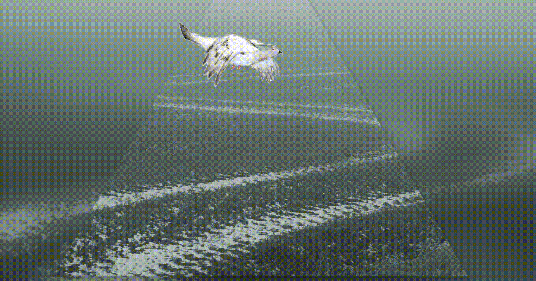
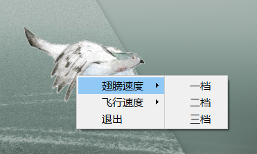

# DesktopBird
桌面小程序 a fly bird  v1.0.0

### 简介
一个桌面端的软件，基于Qt框架开发，无聊的软件。
### 效果演示
* 打开后在桌面上从左往右循环飞行，如图所示：
  ;
  
* 可随意拖动flybird
  
* 可右键点击flybird设置参数
   

   
### 目录介绍
* /MyBird为源码工程目录；/package为QT打包文件，可点击```MyBird.exe```运行；/Setup为安装执行文件。
### 开发环境
* windows + MSVC2017 + QT5.14.2
### 后期计划
* 隐藏执行程序在任务栏的图标
* 添加皮肤更换